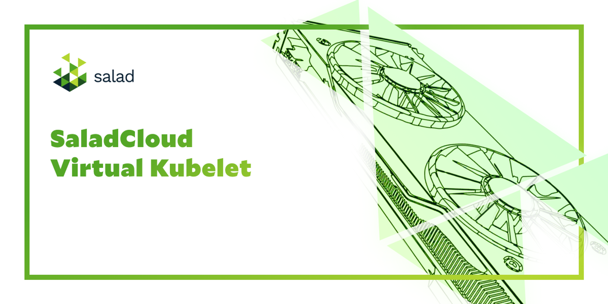
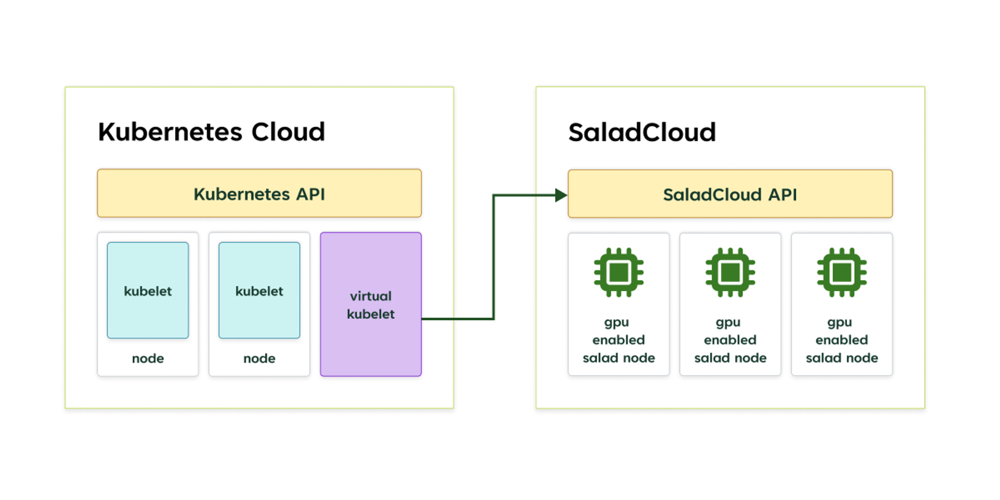

# SaladCloud Virtual Kubelet

[](./LICENSE) [](https://github.com/SaladTechnologies/virtual-kubelet-saladcloud/actions/workflows/ci.yml) [](https://goreportcard.com/report/github.com/SaladTechnologies/virtual-kubelet-saladcloud)

<center>
  <a href="https://github.com/SaladTechnologies/virtual-kubelet-saladcloud"></a>
</center>

Salad's Virtual Kubelet (VK) provider for SaladCloud enables running Kubernetes (K8s) pods as SaladCloud container group deployments. This prototype is currently in development, and not yet ready for production scenarios. If you are interested, please reach out to us to discuss your specific needs.

## How it Works

The SaladCloud Virtual Kubelet creates a _virtual node_ in your K8s cluster.

<center>
  <a href="https://github.com/SaladTechnologies/virtual-kubelet-saladcloud"></a>
</center>

To the K8s API, it looks like a real node. However, when you schedule a pod on the virtual node, a container group deployment is created using the SaladCloud API instead of running the pod on a node in the K8s cluster. The container group deployment runs the pod on a remote, GPU-enabled node on the SaladCloud network.

## Demo

This was used in a presentation at KubeCon2023, the script and pod spec file for the QR code workload are in
the [demo](demo) directory.

## Development

Follow the steps below to get started with local development.

### Prerequisites

- [Git](https://git-scm.com/downloads)
- [Go](https://go.dev/dl)
- [Docker Desktop](https://docs.docker.com/get-docker/) with a [local Kubernetes cluster](https://docs.docker.com/desktop/kubernetes/)

### Getting Started

1. Clone the repository.

   ```sh
   git clone https://github.com/SaladTechnologies/virtual-kubelet-saladcloud.git
   ```

2. Restore the dependencies.

   ```sh
   go mod download
   go mod verify
   ```

3. Build the project.

   ```sh
   make build && make build-image
   ```

4. Run the project in the foreground:

   ```sh
   ./bin/virtual-kubelet-saladcloud --sce-api-key {apiKey} --sce-project-name {projectName} --sce-organization-name {organizationName}
   ```

   Or run the project deployed to your Kubernetes cluster via Helm:

   ```sh
   helm install \
     --create-namespace \
     --namespace salad-cloud \
     --set salad.apiKey=${apiKey} `
     --set salad.organizationName=${organizationName} `
     --set salad.projectName=${projectName} `
     --set imageTag=latest `
     mynode \
     ./charts/virtual-kubelet-saladcloud-chart
   ```
